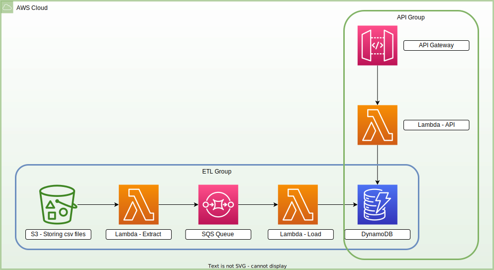

# CMS-NCCI Checker API




# Intro

After a doctor finishes seeing or operating a patient, there is still the issue of payment. The doctor has to get payment from the patient's health insurance.

Since health insurances have to process many such claims, there was a standardization that took place. This procedure is given this code; that procedure is given that code. These two codes can work find together, but those two codes cannot both be used.

These codes have been standardized by AMA (American Medical Assocation) and the list of code pairs that cannot be billed together has been compiled by CMS (Centers for Medicare & Medicaid Services) into multiple xls files. To simplify the process of looking up which codes can work together, expensive softwares were built and sold, creating a market that I conservatively estimated to be in the tens of millions annually.

For this project, I created an API that does the main task of checking which codes can work together and a data pipeline for loading the data into DynamoDB.

Below include instructions for standing up this API and executing the data pipeline.

Even further below is a description of the situation/context for those which wish to read more.


# How to run
## Requirements
To deploy the infrastructure and run the script as detailed below, you need to have the following installed:
1. AWS CLI -- it should also be configured
2. AWS SAM (Serverless Application Model) -- this is the IaC (Infrastructure as Code) tool used in this project

## Step 1. Build and deploy infrastructure to AWS

```bash
sam build
sam deploy --config-file samconfig.toml
```

## Step 2. Upload csv files to S3

Please take the csv files provided in the directory `data/` and upload them to the S3 bucket created in Step 1 above. 

Your S3 bucket should look like the following (note that there should be no `data/` directory in the S3 bucket):
```
<S3 bucket>/
- ncci1.csv
- ncci2.csv
- ncci3.csv
- ncci4.csv
```

This will trigger the data pipeline which will parse the csv files and load the data into DynamoDB.

**Note: This process can take a while since it will be loading 2,000,000+ rows into DynamoDB.**

## Step 3. Destroying the resources (when you're done playing with it)
```bash
sam destroy --config-file samconfig.toml
```

# Additional information

### Explanation of the source of the problem
- Healthcare in the U.S. is a trillion dollar industry. 
- Medicare is the largest healthcare payer, so they have become the default/primary policymaker when it comes to healthcare billing rules.
- Medicare releases their updated billing policies in the form of 4 Excel files with a combined total of 2.5 million rows
- This format (4 large Excel files) is unusable

### Explanation of the problem --> financially hurts patients and doctors
- Led to creation of a multi-million dollar industry that provides annual subscriptions to healthcare billing softwares
- Main components of the software are:
    1. NCCI checker (user inputs multiple CPT codes, and the software returns the relevant records of data)
    2. Detailed description of the CPT codes
    3. Links to the relevant billing documentation on each CPT code page
- The main two companies (AAPC and Optum) charge ~$300 per medical biller per year
- There are approximately 200,000 medical billers/coders in the U.S., and the majority of them need access to this type of software (https://www.zippia.com/medical-biller-coder-jobs/demographics/)
- Unclear on the exact revenue, but it's potentially $300 * 200,000 = $60M per year
- These software subscription charges are billed to the medical billers, whose costs are passed down to the healthcare providers and hospitals, whose costs are ultimately passed down to the patients.

### Explanation of the data
- Healthcare services are billed as "CPT codes"
- CPT codes are which are 5-character codes that represent the services performed
    - Colonoscopy is CPT code 45380
    - A typical clinic visit is 99213
    - Excising a small skin cancer is 11600
- Each CPT codes has a nationally recognized relative value unit, which basically placed a numeric value to the work performed
- Healthcare payers translate CPT codes into an exact dollar value
- Certain combinations of codes cannot be billed together--for Medicare, these are called "NCCI bundles" 
- Medicare's billing rules include ~2.5 million NCCI bundles in 4 Excel files
- There's a need for a free/cheaper NCCI checker

